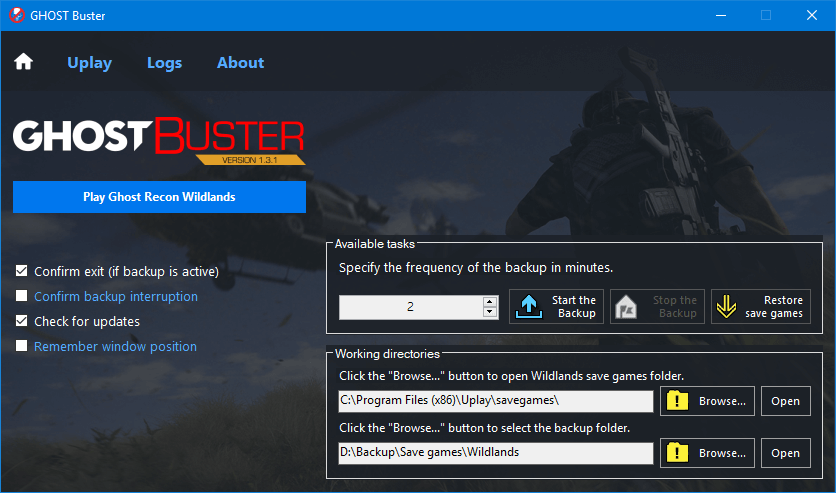

<h1 align="center">
  <br>
  </a>
  <br>
  GHOST Buster
  <br>
</h1>

<h4 align="center">Backup and restore Ghost Recon Wildlands save games.</h4>

<p align="center">
  <a href="#about">About</a> •
  <a href="#getting-started">Getting Started</a> •
  <a href="#settings">Settings</a> •
  <a href="#download">Download</a> •
  <a href="#license">License</a>
</p>

## About

**GHOST Buster** will automatically backup your Wildlands save games while the game is running.

I created this software to backup [Ghost Mode](https://web.archive.org/web/20190108052618/https://ghost-recon.ubisoft.com/wildlands/en-us/news/152-328968-16/special-operation-2-is-coming) save games, hence the name "GHOST Buster".

Some friends of mine also requested it so I released it here on GitHub.

## Getting Started

* Launch **GHOST Buster.exe**.
  * Every time you launch it, the program will check the System Registry to see if Ghost Recon Wildlands and Uplay are installed.
  * When you close it, a file containing the program's settings will be created (or updated if it already exists) inside `%LOCALAPPDATA%\GHOSTbackup`

* Click the first **Browse...** button to select the folder where Wildlands save games are actually stored.
  * They are usually located inside `C:\Program Files (x86)\Ubisoft\Ubisoft Game Launcher\savegames\y0ur-r4nd0m-us3r-1dent1f13r\1771`

* Click the second **Browse...** button to select where Wildlands save games will be backed up to.
  * A folder with the format `yyyyMMdd HHMM` will be created at every backup

* Finally, specify the backup interval and click the **Start The Backup** button. To interrupt the process, click **Stop The Backup**.

### Dead?

* Close the game and interrupt the backup process.

* Click the second **Browse...** button and select the last folder created before you died.
  * There is no quick way to restore a previous save game, you will have to pick a folder manually *for now*.

* Click **Restore save games**.

> ### ⚠️ **WARNING**
>
> Disable cloud synchronization before proceeding, otherwise Uplay will download the old save games rendering the restore process useless.
>
> Also note that restoring a backup will **OVERWRITE** your old save games. This **CANNOT BE UNDONE**.

## Settings

* **Confirm exit (if backup is active)**
  * _Enabled by default_
  * The program will warn you before closing it if the backup is active

* **Confirm backup interruption**
  * _Disabled by default_
  * The program will ask you if you're sure you want to interrupt the current backup process

* **Check for updates**
  * _Disabled by default_
  * The program will connect to GitHub servers to check if the current version is up to date

* **Remember window position**
  * _Disabled by default_
  * The program will remember the window position the last time GHOST Buster was used

All settings are stored inside `%LOCALAPPDATA%\GHOSTbackup`.

## Download

You can [download](https://github.com/Strappazzon/GRW-GHOST-Buster/releases/latest) the latest version of GHOST Buster from the Releases page.

## License

```
Copyright (c) 2019 - 2020 Alberto Strappazzon

Permission is hereby granted, free of charge, to any person obtaining a copy
of this software and associated documentation files (the "Software"), to deal
in the Software without restriction, including without limitation the rights
to use, copy, modify, merge, publish, distribute, sublicense, and/or sell
copies of the Software, and to permit persons to whom the Software is
furnished to do so, subject to the following conditions:

The above copyright notice and this permission notice shall be included in all
copies or substantial portions of the Software.

THE SOFTWARE IS PROVIDED "AS IS", WITHOUT WARRANTY OF ANY KIND, EXPRESS OR
IMPLIED, INCLUDING BUT NOT LIMITED TO THE WARRANTIES OF MERCHANTABILITY,
FITNESS FOR A PARTICULAR PURPOSE AND NONINFRINGEMENT. IN NO EVENT SHALL THE
AUTHORS OR COPYRIGHT HOLDERS BE LIABLE FOR ANY CLAIM, DAMAGES OR OTHER
LIABILITY, WHETHER IN AN ACTION OF CONTRACT, TORT OR OTHERWISE, ARISING FROM,
OUT OF OR IN CONNECTION WITH THE SOFTWARE OR THE USE OR OTHER DEALINGS IN THE
SOFTWARE.
```
